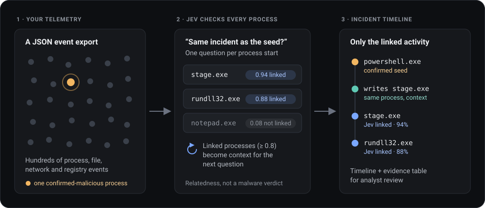

# Jev Incident Timeline

**Start from one process you know is malicious. Get back the incident.**

**[Try it in your browser →](https://tsale.github.io/jev-incident-timeline/)** · [Run it locally](#quick-start)

<p align="center">
  
</p>

Once an analyst confirms one malicious process, the next question is always *what else is part of this?* This proof of concept puts that question to [Jev](https://docs.typesafe.ai/), TypeSafe's structured-decision model, one process at a time, and turns the answers into an incident timeline you can review.

It comes with **Casebench**, a web portal you can use as a website or run locally, and a command-line script. Nothing to install: the website runs in your browser, and the local version uses only the Python standard library.

> [!NOTE]
> This is an experimental proof of concept, not a validated detector. A Jev score measures **relatedness to the incident**, not whether a process is malicious. Every result needs analyst review.

## Two ways to use it

| | **Website** | **Local portal** |
|---|---|---|
| Start | Open **[tsale.github.io/jev-incident-timeline](https://tsale.github.io/jev-incident-timeline/)** | `python3 web_app.py` (see [Quick start](#quick-start)) |
| Your API keys | Typed into the page; kept in your browser only | Saved in `.env` on your machine |
| Where data goes | From your browser straight to TypeSafe (and OpenRouter, if you ask for a narrative) | From your machine straight to the same providers |
| Evidence | **Download run (JSON)** | Private bundle in `.local-runs/` |

**The website has no backend.** Your keys and the files you load are never sent to us. The page's security policy only allows connections to `api.typesafe.ai` and `openrouter.ai`, so you can verify this in your browser's developer tools. The providers do receive the telemetry you analyze, under their own terms.

> [!IMPORTANT]
> The website needs TypeSafe's API to accept requests from web pages (CORS). As of October 2026 it doesn't yet, so **Analyze with Jev** on the website stops with a message explaining this. Until TypeSafe enables it, use the local portal. OpenRouter already accepts browser requests.

## Quick start

You need **Python 3.9 or newer** (the `python3` that ships with macOS works) and a **TypeSafe API key** ([TypeSafe Quick Start](https://docs.typesafe.ai/introduction/quickstart)).

```bash
git clone https://github.com/tsale/jev-incident-timeline.git
cd jev-incident-timeline
python3 web_app.py --setup-keys   # paste your key; input is hidden and saved to .env
python3 web_app.py                # start the portal
```

Open **http://127.0.0.1:8765** and:

1. Click **Load bundled malicious-events example** (or drop in your own JSON export).
2. Check the **Starting execution**, the process you have confirmed as malicious, and add a sentence of **Analyst context**.
3. Click **Analyze with Jev**. The **Event timeline** opens when the answers are in.

Press `Ctrl+C` to stop. Run `python3 web_app.py` again whenever you need it; your keys and recent runs are kept.

## Adding your API keys

| Key | Needed for | Sent to |
|---|---|---|
| `TYPESAFE_API_KEY` | **Analyze with Jev** (required) | `api.typesafe.ai` |
| `OPENROUTER_API_KEY` | **Request narrative** (optional AI-drafted titles and summaries) | `openrouter.ai` |

Choose one of these ways to add them:

- **Guided (recommended):** `python3 web_app.py --setup-keys` asks for each key with hidden input and writes them to `.env` with private permissions. Run it again to change a key; press Enter to keep the current one.
- **By hand:** copy the template, make it private, then fill in the values:

  ```bash
  cp .env.example .env
  chmod 600 .env
  ```

- **Environment variables:** if `TYPESAFE_API_KEY` or `OPENROUTER_API_KEY` is already set in the server's environment (for example by a secret manager), it takes precedence over `.env`.

The server reads the keys on every request, so after you edit `.env`, click **Refresh** in the portal; there's no need to restart. Keys stay on the server: the browser only ever sees "ready" or "missing". On macOS and Linux the server refuses a key file that other users can read, and the portal tells you the exact `chmod` to run.

## Using the portal

| Tab | What it does |
|---|---|
| **Source & analysis** | Import a JSON export, choose the confirmed starting execution (the *seed*), add context, and run **Analyze with Jev**. Importing never leaves your browser. |
| **Event timeline** | The seed, every execution Jev linked to it, and other activity from those same processes, in time order. |
| **Evidence table** | The same incident rows in an 11-column table: Timestamp, Host, Phase, Title, Description, Tools, TTPs, Command Line, Indicator, Type, Pyramid. |

How to read the scores:

| Label | Meaning |
|---|---|
| `100% · analyst confirmed` | The seed. This is your confirmation, not a Jev prediction. |
| `94% · Jev relatedness` | Jev's probability that this execution belongs to the same incident. Linked at 0.8 or above. |
| `100% · entity match` | A file, network or registry event from the same host and process as a linked execution. This is an exact identity match, not a Jev score. |

**Request narrative** is an optional second step. It sends the linked events (50 at most) to OpenRouter's `deepseek/deepseek-v4.1-flash`, which drafts a title and summary for each row. The server rejects drafts that cite unknown event IDs. The narrative is a draft for you to verify, never a verdict.

If an analysis fails partway (for example, during a provider outage), a **Resume** button reuses every Jev answer you already paid for and asks only the remaining questions. Resume points are saved on disk, so they survive a restart.

### Portal options

| Option | Default | Purpose |
|---|---|---|
| `--port` | `8765` | Port on `127.0.0.1` |
| `--setup-keys` | | Prompt for the API keys, save them to `.env`, and exit |
| `--env-file` | `.env` | Where keys are read from |
| `--run-root` | `.local-runs/` | Private evidence bundle for each analysis |
| `--retention-days` | `14` | Delete web runs this many days after their last write |
| `--replit-preview` | | Serve through a Replit workspace preview, with an access code printed to the console for provider calls |

## Command line

The same analysis runs without the portal:

```bash
python3 jev_incident.py examples/malicious_events.json \
  --seed-id VvT8xKABOYkemEz9sgQR \
  --description "Analyst-confirmed 2.8.exe execution on CLA-WS-214." \
  --run-dir runs/first-run
```

It prints one line per execution with the decision, probability and the evidence category Jev selected (`lineage`, `interaction`, `artifact`, `user_host_time` or `no_link`; Jev chooses a category rather than writing prose). It reads the key from the environment or `.env`.

- `--run-dir DIR` writes an auditable bundle: `summary.json` (time, calls, tokens, input hash), `attempts.jsonl` (every call, including retried failures), `decisions.json` and `evidence/`.
- `--resume-run OLD --run-dir NEW` continues a failed run, reusing only answers whose exact request matches.
- `--threshold` (default `0.8`), `--model` (default `jev-1.13.0`) and `--output decisions.json` are also available.

## How it works

For each other process start in the export, in time order, the tool sends Jev one request containing:

- the **seed** and your description,
- the **candidate** process,
- up to six **recently linked** executions, so the evidence builds up as links are found,
- up to eight **nearby events** from the same host (same process lineage, or within 10 minutes).

Jev returns a probability that the candidate is related, plus an evidence category. Candidates at 0.8 or above are linked and become context for later questions. If the first pass found any new links, the remaining candidates are asked once more with the expanded context.

[ARCHITECTURE.md](ARCHITECTURE.md) covers the exact request shape, field mapping, evidence files, resume rules, measured results and limitations in detail.

## Input format

The input is a JSON array of events, or `{"events": [...]}`. ECS documents and Elasticsearch hits are supported, either with `_source` or with the dotted `fields` format. Each event needs a unique `id`, `_id` or `event.id`. The seed must be a process start. The portal accepts up to 500 events and 2 MiB.

A minimal input looks like this (see [tests/fixtures/synthetic.json](tests/fixtures/synthetic.json)):

```json
{"events": [
  {"id": "seed", "@timestamp": "2026-09-21T17:18:50Z", "kind": "execution", "host": "WS-01",
   "process": {"name": "powershell.exe", "pid": 400, "entity_id": "proc-seed"}},
  {"id": "child", "@timestamp": "2026-09-21T17:18:52Z", "kind": "execution", "host": "WS-01",
   "process": {"name": "stage.exe", "pid": 410, "entity_id": "proc-child", "parent": {"entity_id": "proc-seed"}}}
]}
```

### The bundled example

[examples/malicious_events.json](examples/malicious_events.json) holds 100 Elasticsearch (Sysmon) records from a lab detonation of `2.8.exe` on host `CLA-WS-214`. The seed is `VvT8xKABOYkemEz9sgQR`. The export covers about 11 seconds, so it doesn't include the incident's later steps. SHA-256: `d9b1c28d03053099878a8816333b0ca31b0b3abc460a473fe9b72714a1dd39b4`.

## What leaves your machine

This applies to both the website and the local portal.

| Action | What is sent | Where |
|---|---|---|
| Open the portal or import a file | Nothing | |
| **Analyze with Jev** | For each candidate: selected fields only (IDs, time, host, user, process name, path, command line, PIDs, entity IDs, hashes, file and destination fields) of the seed, the candidate and its context events | TypeSafe |
| **Request narrative** | The seed, the linked executions and their same-process events (50 at most) | OpenRouter |

Only analyze telemetry you're allowed to share with these providers. On the website, keys live in the page's memory unless you tick **Remember on this device** (then in that browser's local storage; **Forget keys** removes them). In the local portal, each analysis writes an evidence bundle to `.local-runs/`, which is private, git-ignored and deleted 14 days after its last write. The server listens on `127.0.0.1` only, rejects cross-origin requests and never sends keys to the browser. It's a single-user local tool, so don't expose it to a network.

## Limitations

- **No accuracy claim.** The tests mock both providers, and the 0.8 threshold is an experimental cut-off. Below the threshold means "not enough evidence to link", not "benign".
- **Local JSON only.** There is no live Elasticsearch or SIEM query. Context selection scans the whole input for each candidate, which is fine for hundreds of events but not for millions.
- **Context is not proof.** Nearby events are hints for Jev, and PIDs can be reused. The CLI doesn't require candidates to come after the seed, so prepare the time window you want.

## Development

```bash
python3 -m unittest -v test_jev_incident.py test_web_app.py
node ui/test_engine.js && node ui/test_app.js && node ui/test_access.js && node ui/test_browser.js
```

All tests run offline with mocked providers. The JavaScript tests need Node.js; the app itself doesn't. `ui/engine.js` is a port of `jev_incident.py`, and `ui/test_engine.js` checks that it sends Jev byte-for-byte the same requests on three fixtures. After an intentional change to the Python engine, regenerate the reference with `python3 -c "import test_jev_incident as t; t.write_golden()"` and update the port until both suites pass.

### Publishing the website

The [Website workflow](.github/workflows/pages.yml) runs every test, builds the site and deploys it to GitHub Pages on each push to `main`. To turn it on, open **Settings → Pages** and set **Source** to **GitHub Actions**. To preview the site locally:

```bash
python3 scripts/build_site.py
python3 -m http.server 8000 --bind 127.0.0.1 --directory _site
```

Any static host works too: upload the contents of `_site/`. Don't let the host inject scripts or analytics, because the page's security policy would block them and the privacy statement relies on there being none.

| Path | Contents |
|---|---|
| `jev_incident.py` | Normalization, context selection, Jev requests, evidence bundles, CLI |
| `web_app.py` | Casebench server: static UI, `/api/analyze`, `/api/narrate`, key handling, retention |
| `ui/` | Shared portal JavaScript and CSS, the local portal page, and `engine.js` (the browser port of the engine) |
| `site/index.html` | The website page: key panel, privacy notice, connection policy |
| `scripts/build_site.py`, `.github/workflows/pages.yml` | Website build and GitHub Pages deployment |
| `examples/`, `tests/fixtures/` | Bundled lab export; synthetic and edge-case fixtures; the engine parity reference |
| `docs/` | README illustration |
